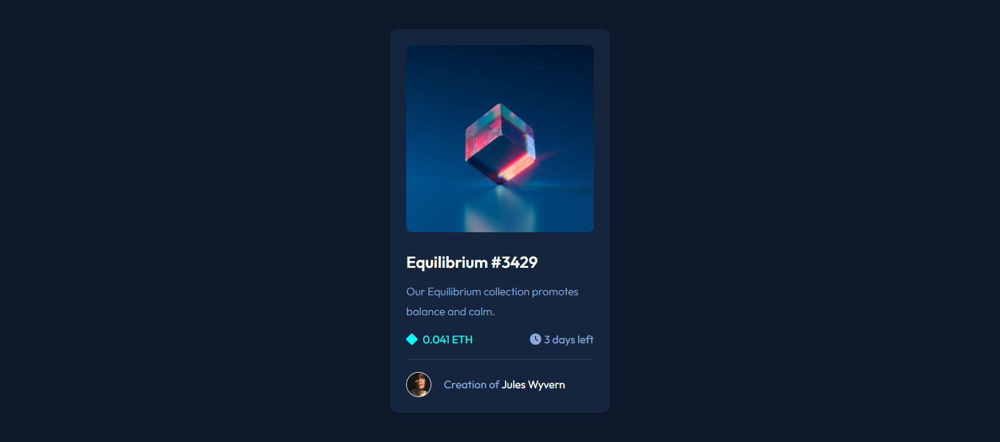

# Frontend Mentor - NFT preview card component solution

This is a solution to the [NFT preview card component challenge on Frontend Mentor](https://www.frontendmentor.io/challenges/nft-preview-card-component-SbdUL_w0U). Frontend Mentor challenges help you improve your coding skills by building realistic projects. 

## Overview

### The challenge

Users should be able to:

- View the optimal layout depending on their device's screen size
- See hover states for interactive elements

### Screenshot

### Links

- Solution URL: (https://github.com/ahmedZ0k/nft-preview-card)
- Live Site URL:(https://ahmedz0k.github.io/nft-preview-card/)

## My process

### Built with

- Semantic HTML5 markup
- CSS custom properties
- CSS Flexbox
- Mobile-first workflow

### What I learned

- Create an image overlay by creating another div and make it adapted.
- use margin instead of padding in image div to make the border radius of image more effictive

### Continued development

- footer outside the main div 

### Useful resources

- [Example resource 1](https://www.w3schools.com/howto/howto_css_image_overlay_title.asp) - This helped me for image overlay reason. I really liked this pattern and will use it going forward.

## Author

- Frontend Mentor - https://www.frontendmentor.io/profile/ahmedZ0k
- Linkedin - https://www.linkedin.com/in/ahmed-zakaria-63b72b1b5/
- Github - https://github.com/ahmedZ0k
